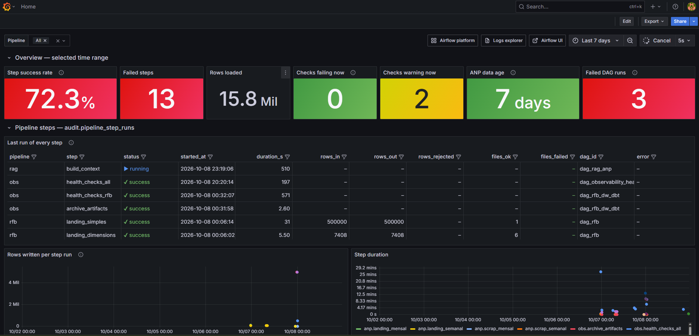
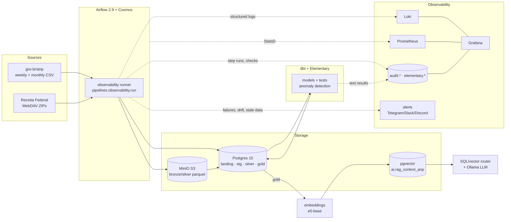

# DataLabs — observable data pipelines, from DW to RAG

[](https://github.com/engrodrigoa/datalabs/actions/workflows/ci.yml)


A production-style data platform that runs on a laptop with one command. It ingests Brazilian public
data (**ANP** fuel prices and **Receita Federal** CNPJ registry), models it with **dbt**, serves it to a
**RAG** assistant on **pgvector**, and makes every step **observable**: structured logs, platform
metrics, per-step volumes, and data health checks, all in Grafana.

> **The question this project answers:** *is the data right, complete and on time, and how would I know if it wasn't?*

<!-- Screenshot: run `make up && make demo`, open Grafana, capture "DataLabs · Pipeline Health" -->


---

## What this project demonstrates

| Area | Evidence in this repo |
|---|---|
| **Observability** | structured logs (readable line + JSON fields) → Loki, Airflow StatsD → Prometheus, per-step audit table, 3 dashboards as code, alerting to Telegram/Slack/Discord |
| **Data quality** | dbt tests + **Elementary anomaly detection** (volume, freshness, column) + config-driven **freshness / volume / reconciliation** checks across layers |
| **Reliability** | idempotent loads, late-arriving data handled, schema-drift detection, honest exit codes (no "green with no data") |
| **AI data engineering** | embeddings → pgvector (HNSW), SQL-vs-vector query router, **golden-set evaluation as a quality gate** in the DAG |
| **DataOps** | CI runs lint, unit tests, a real Postgres + dbt build + checks, and executes every Grafana query; pinned images; one-command setup |
| **Data modeling** | medallion layers (landing → staging → silver → gold), star schemas for ANP and RFB, incremental models |

---

## Architecture



---

## Observability, in depth

### Four signals, one place

| Signal | How it is produced | Where it lives | Question it answers |
|---|---|---|---|
| **Logs** | every script logs JSON events (`event=file_loaded`, `schema_drift_missing_columns`, `step_finished`…) with `dag_id/run_id/task_id` attached automatically | Loki (Promtail parses the JSON) | *What happened, exactly?* |
| **Metrics** | Airflow StatsD → `statsd-exporter` (labelled by `dag_id`/`task_id`) | Prometheus | *Is the platform healthy?* scheduler heartbeat, queue, p95 task duration, import errors |
| **Step facts** | the runner wraps every script and records status, duration, rows in/out/rejected, files ok/failed | `audit.pipeline_step_runs` | *How much data moved, and is it normal?* (baseline = median of the last 10 runs) |
| **Data health** | dbt tests + Elementary anomalies at build time; `checks.yml` on a schedule | `elementary.*`, `audit.data_quality_checks` | *Is the data fresh, complete and consistent between layers?* |

### Zero-touch instrumentation

Every task runs its script through one wrapper. The script itself does not change. It can optionally report volumes:

```python
# airflow: observed_script("landing_semanal", "anp", "anp/anp_03_anp_landing_semanal.py")
from pipelines.observability import current_step

step = current_step()
step.add(rows_in=df.height, files_total=len(files))
step.add(rows_out=written)          # -> audit.pipeline_step_runs + step_finished event
```

Exit codes keep their Airflow meaning: `0` success, `99` skipped (*no new data*), anything else failed.

### Data health checks (`pipelines/observability/checks.yml`)

```yaml
- name: anp_silver_to_gold_reconciliation   # did rows get lost between layers?
  type: reconciliation
  query: SELECT COUNT(*) FROM silver.anp_combustivel
  compare_query: SELECT COUNT(*) FROM gold.ft_anp_combustiveis
  tolerance_pct: 0

- name: anp_gold_data_freshness               # is the source still publishing?
  type: freshness
  query: SELECT MAX(data_coleta) FROM gold.ft_anp_combustiveis
  warn_after_hours: 240
  error_after_hours: 408
```

The checks run at the end of every pipeline **and** every 6 hours in `dag_observability_health`, so a source
that silently stops publishing is detected even when no DAG runs. Coverage includes freshness, volume, UF
coverage, invalid prices, orphan facts, stg→silver→gold reconciliation, suspicious RFB rows, duplicate keys,
RAG context parity, RAG accuracy, and stale "running" steps (killed by OOM).

### Dashboards (versioned as code: `grafana/dashboards-src/build.py`)

| Dashboard | Content |
|---|---|
| **Pipeline Health** (home) | success rate, failed steps, rows loaded, failing checks, data age · last run of every step · volume vs. baseline · check status · dbt/Elementary test results · slowest models · Airflow DAG runs and task failures · RAG accuracy per evaluation · error logs |
| **Airflow Platform** | scheduler heartbeat, import errors, executor slots, task outcomes, p95 duration per DAG, schedule delay, DAG parse time |
| **Logs Explorer** | filter by DAG / level / event / free text, parsed JSON events and raw logs |

Grafana reads Postgres through a **read-only role** (`grafana_ro`), and Airflow metadata lives in its own database.

### Alerting

Configure one channel in `.env` (`TELEGRAM_BOT_TOKEN`/`TELEGRAM_CHAT_ID` or `ALERT_WEBHOOK_URL`). Alerts are designed to fire **once, on the root cause**:

* task failure → Airflow callback **after the last retry**
* partial load (some files failed) → runner
* failing / warning data checks → checks
* SLA miss on the ANP DAG
* the final audit task **fails the DAG run** when any task failed (an `ALL_DONE` leaf would otherwise mark the run green), and it does not send an alert of its own

---

## Data products

### ⛽ ANP — fuel prices (`dag_dbt_anp`, weekly)

`scrape (weekly + monthly) → landing (Postgres) → dbt: stg → silver → gold star schema → Elementary → health checks`

* **Late-arriving data:** the monthly closed file arrives weeks later with old survey dates. The incremental fact
  uses the *ingestion* watermark, not the business date, so those rows are not silently dropped.
* **Schema drift:** files are validated against the expected contract. A file with missing columns is rejected (and alerted), and extra columns are dropped with a warning.
* **History preserved:** the weekly file keeps the same name every week, so each load is keyed by survey reference instead of being overwritten.
* Gold: `ft_anp_combustiveis`, `dm_postos`, `dm_produtos`, with tests and Elementary volume/freshness/column anomaly monitors.

### 🏢 RFB — CNPJ open data (`dag_rfb` → `dag_rfb_dw_dbt`)

`WebDAV ZIPs → bronze parquet (MinIO) → silver parquet (typed, audited) → DW landing (COPY) → dbt gold`

* Tens of millions of rows on a single node with Polars + PyArrow batches ([ADR 0002](docs/adr/0002-polars-single-node.md)).
* Shifted-column detection (`_suspeita_deslocamento`) is tracked as a % metric with a threshold.
* Download → bronze → silver → landing with parallel entities (bounded by `max_active_tasks`), with the `ref_month` parameter set from the UI.
* Dataset-driven scheduling: landing emits `datalabs://landing/rfb`, which triggers the dbt DAG.

### 🧾 NF-e — tax reform DW (IBS/CBS/IS) (`dag_nfe`, sensor-driven)

`simulated issuer → inbox → batch (ctrl) → bronze via SQL (pg_read_file) → dbt: XMLTABLE silver → gold star schema`

* **SQL + dbt only:** ingestion is a PL/pgSQL function and parsing is `XMLTABLE` in dbt. Python only orchestrates and simulates the source system. The XML structure is validated against the official XSDs (IBS/CBS/IS groups, alphanumeric CNPJ).
* **Batch-level control instead of a per-row flag:** the bronze table is insert-only, each batch moves `CARREGADO → PROCESSADO`, and corrected batches are re-queued and merged idempotently ([ADR 0006](docs/adr/0006-nfe-incremental-lotes.md)).
* **SCD2 that survives late-arriving notes:** the participant version key is derived from the note's own attributes, with no date-range join. A `dbt snapshot` is used only where processing time is the right semantics (the cClassTrib reference table).
* **Quality scoped to the batch in flight:** contracts on silver, custom generic tests (access-key and CNPJ check digits, cClassTrib × CST), header × item reconciliation, `store_failures` quarantine in `dq_nfe`, Elementary volume monitor.
* Details: [docs/nfe/README.md](docs/nfe/README.md) · try it: `make nfe-backfill`, `make nfe-stream`.

### 🤖 RAG — fuel price assistant (`dag_rag_anp`, triggered when ANP gold changes)

`gold → semantic chunks (lineage to id_fato) → multilingual-e5 embeddings → pgvector HNSW → evaluation gate`

* **Router:** questions with a CNPJ or an aggregation go to exact SQL on gold. Open questions go to vector search. The LLM is told which lines are exact ([ADR 0005](docs/adr/0005-rag-router.md)).
* **Evaluation as a quality gate:** a golden set with SQL ground truth measures routing and value accuracy after every rebuild, and the task **fails below the threshold**. History lives in `ai.rag_eval_*` and is plotted in Grafana.
* **Bulk vector load:** the HNSW index is dropped and rebuilt around the COPY. On 8k vectors this is about 5× faster than inserting into a live index (104 s → 19 s, timings recorded in the step metrics).
* Interactive assistant (local LLM through Ollama): `python pipelines/rag/anp/rag03_generator.py`.

---

## Quickstart

**Requirements:** Docker with Compose v2, ~8 GB RAM free, ~10 GB disk. GNU make is optional (the raw commands are below).

```bash
git clone https://github.com/engrodrigoa/datalabs.git && cd datalabs
make up        # creates .env with random passwords, builds and starts the stack
make demo      # unpauses the DAGs and runs the ANP pipeline with real data
```

| Service | URL | |
|---|---|---|
| Grafana | http://localhost:3000 | home = *DataLabs · Pipeline Health* |
| Airflow | http://localhost:8080 | DAGs start paused |
| MinIO console | http://localhost:9091 | |
| Prometheus | http://localhost:9090 | |

Credentials are in `.env`.

<details>
<summary>Without make</summary>

```bash
cp .env.example .env            # then change the passwords
docker compose up -d --build
docker compose exec airflow-scheduler airflow dags unpause dag_dbt_anp
docker compose exec airflow-scheduler airflow dags trigger dag_dbt_anp
```
</details>

<details>
<summary>AI profile (RAG) and GPU</summary>

```bash
make up-ai     # image with sentence-transformers (CPU torch) + Ollama on CPU (llama3.2:1b)
make up-gpu    # same, Ollama on an NVIDIA GPU (needs nvidia-container-toolkit)
```
The default stack does **not** require a GPU. Without the AI image, `dag_rag_anp` skips cleanly.
</details>

<details>
<summary>Offline demo (no internet)</summary>

```bash
make up && make demo-offline   # synthetic ANP files (real layout) -> landing -> dbt + Elementary -> health checks
```
</details>

---

## Repository layout

```text
airflow/dags/                 DAGs (ANP, RFB, RFB dbt, RAG, setup, observability health)
pipelines/
  anp/  rfb/  rag/anp/        ingestion + AI scripts
  commons/                    logger (JSON), env, S3, Postgres COPY, RAG router
  observability/              runner, step tracker, checks (+ checks.yml), alerting, Airflow callbacks
  dbt_projects/               dbt project: staging · silver · gold, Elementary, profiles via env vars
infra/
  postgres/init/              bootstrap (airflow DB, grafana_ro) + idempotent DDL (single source of truth)
  promtail/  prometheus/      log pipeline, StatsD mapping, scrape config
grafana/
  provisioning/               datasources (fixed UIDs) + dashboard provider
  dashboards-src/build.py     dashboards as code  ->  grafana/dashboards/*.json
tests/                        unit tests + dashboard SQL validation
docs/adr/                     architecture decision records
scripts/                      sample data generator
```

## Testing & CI

`.github/workflows/ci.yml` runs on every push:

1. **lint + unit tests**: ruff, pytest (runner exit codes, checks logic, schema-drift detection, log format parsed with the same regex as Promtail), and dashboards regenerated from code with no diff allowed.
2. **compose**: `docker compose config` for the default, AI and GPU variants.
3. **data integration**: Postgres + pgvector service, bootstrap script, synthetic ANP files landed through the runner, `dbt build` with Elementary, data health checks, assertions on the audit trail, and **every Grafana SQL query executed as `grafana_ro`**.

## Engineering decisions

* [0001 — Observability: three signals + data health](docs/adr/0001-observability-architecture.md)
* [0002 — Polars on a single node instead of Spark](docs/adr/0002-polars-single-node.md)
* [0003 — Promtail now, Grafana Alloy next](docs/adr/0003-promtail-to-alloy.md)
* [0004 — Object storage after MinIO's image freeze](docs/adr/0004-object-storage.md)
* [0005 — RAG over tabular data: SQL first, vectors second](docs/adr/0005-rag-router.md)
* [0006 — NF-e: batch-level control, immutable bronze, SQL-only transformation](docs/adr/0006-nfe-incremental-lotes.md)

## Roadmap

- [ ] Grafana Alloy + Loki 3 (structured metadata for `run_id`)
- [ ] OpenLineage → Marquez lineage across Airflow and dbt
- [ ] Unstructured corpus for RAG (ANP resolutions, RFB manuals) + answer-level evaluation
- [ ] Data contracts published from dbt (`contract: enforced`) for the gold layer
- [ ] Airflow 3 migration
- [ ] Public read-only demo (Streamlit over a gold snapshot)

## Author

**Rodrigo Arruda Carneiro**, Data Engineer: from traditional DW to vector databases, focused on observability and data quality through DataOps and CI/CD.
[GitHub](https://github.com/engrodrigoa) · [LinkedIn](https://www.linkedin.com/in/rodrigoarruda89)

<sub>Data sources: ANP — Série histórica de preços de combustíveis; Receita Federal — Dados Abertos do CNPJ. Public data, used for study purposes.</sub>
